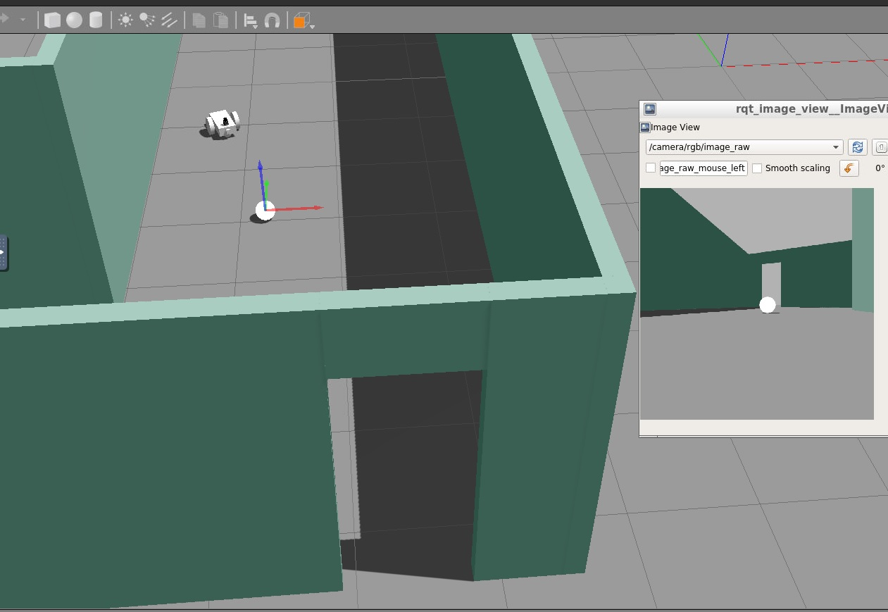

## Project: Go Chase It!
The first task in this project is to create the _my_robot_ ROS package. Inside _my_robot_, A Gazebo world file is created and stored.  
The second major task in this project is to create the _ball_chaser_ ROS package. Within this package, the image captured by the camera is analyzed to determine the position of a white ball. Then the robot is drived toward the ball. The nodes in _ball_chaser_ will communicate with the _my_robot_ package by subscribing to the robot camera sensor and publishing to the robot’s wheel joints.

