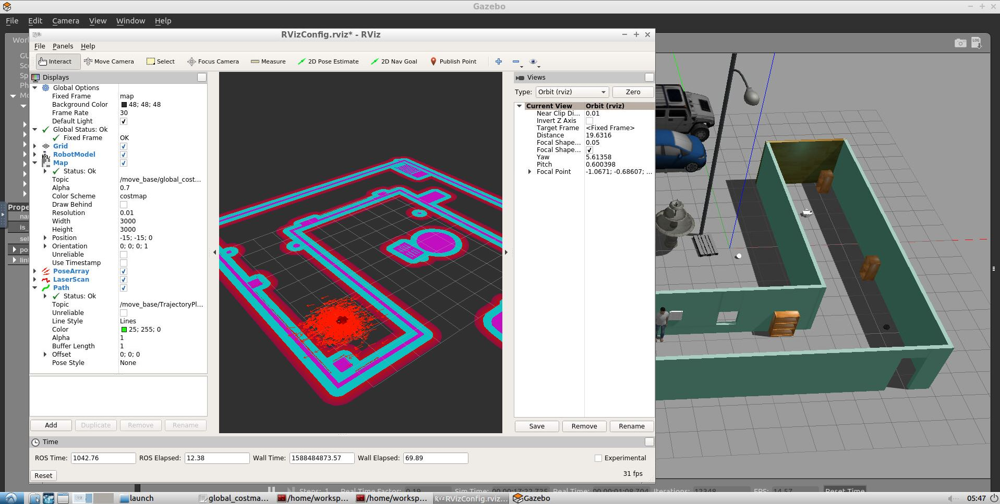

## Project: Where Am I?
In this project, ROS AMCL package is used to accurately localize a mobile robot inside a map in the Gazebo simulation environments.
Over this project, several aspects of robotic software engineering are applied with a focus on ROS:
- Creating a ROS package that launches a custom robot model in a custom Gazebo world
- Utilizing the ROS AMCL package and the Tele-Operation / Navigation Stack to localize the robot
- Exploring, adding, and tuning specific parameters corresponding to each package to achieve the best possible localization results

